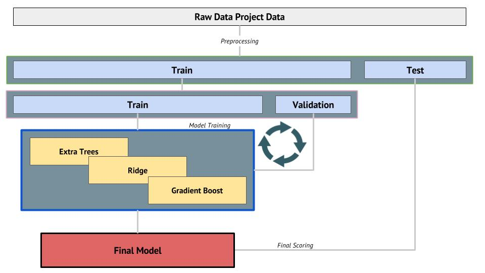
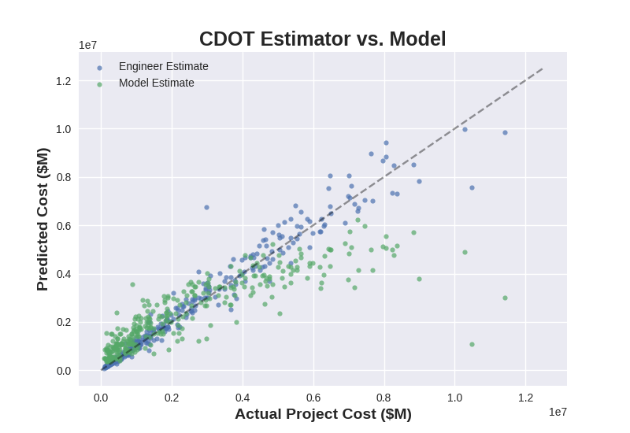

<b>CDOT Project Estimator</b>
===========================

#### Project Objective:
<b>Develop a method for accurately estimating construction projects.</b>

#### Problem Overview:
In the past 5 years, construction projects for CDOT have been under-estimated by 15.15%.
Current estimating process relies heavily on estimator knowledge. While this is very effective, it becomes highly subjective and difficult to reciprocate. The aim of this project is to simplify and streamline the estimating process using machine learning.

#### Process

Cross Validation was used to create the model. The final model includes a stacked ExtraTreeRegressor, Ridge, and GradientBoostingRegressor modules from sklearn.

### Final Model Performance

The final model resulted in an r-squared score of 69%. The figure below shows the model's performance on the test data compared with that of a construction estimator.

